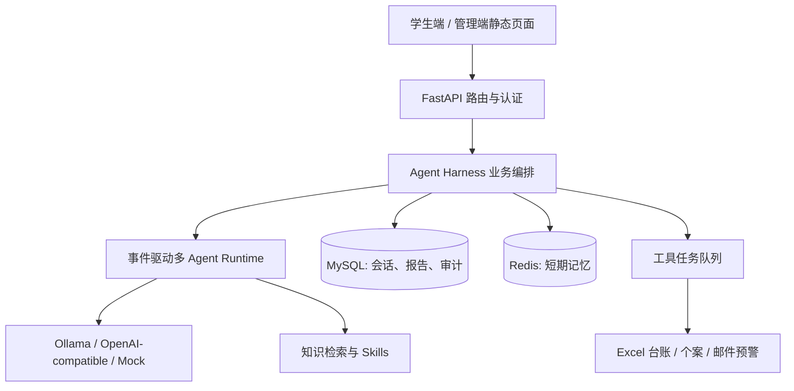
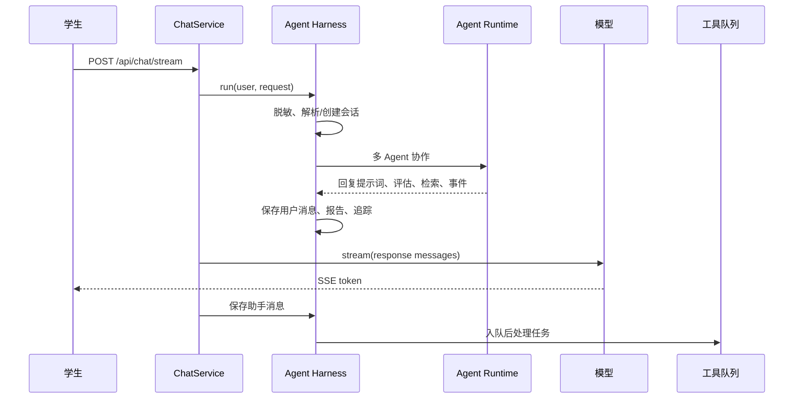
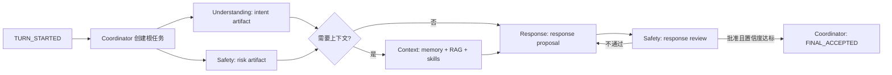

# MindBridge 从零构建学习指南

> 目标：理解这个项目如何被拆解并逐步实现，而不只是知道每个目录的用途。
>
> 本文的“构建顺序”根据当前代码的依赖关系整理，并非 Git 历史还原（当前工作目录没有可用的 Git 提交历史）。阅读时可将它当作重新做一遍同类项目的路线图。

## 1. 先定义问题，而不是先写 Agent

MindBridge 是面向校园心理支持场景的聊天应用。它要同时满足四类约束：

1. 学生需要流式、低等待感的对话体验。
2. 心理咨询和高风险表达需要不同于闲聊的处理策略。
3. 涉及风险时，系统必须留下报告、可追溯记录，并能通知人工人员。
4. 大模型、向量库、Redis 或邮件服务暂时不可用时，主对话不能整体失效。

因此，它不是“网页 + 一个 LLM 调用”，而是四层系统：



这张图也是开发时的依赖顺序：先让最小 Web + 数据闭环可运行，再增加模型、检索和多 Agent；不要反过来先堆复杂提示词。

## 2. 阶段一：搭出可启动的 Web 骨架

### 2.1 选择技术边界

项目使用 Python 3.12、FastAPI、SQLAlchemy、MySQL、Redis 和原生 HTML/CSS/JavaScript。依赖定义在 `requirements.txt`，容器化定义在 `Dockerfile` 与 `docker-compose.yml`。

为什么这样选：

- FastAPI 原生支持 ASGI 与异步生成器，适合 SSE 流式输出。
- SQLAlchemy 将业务数据模型与 MySQL/SQLite 测试环境隔离。
- Redis 只承担可过期的短期上下文；关键业务记录不依赖它。
- 原生前端足够支撑两个操作界面，减少前端构建工具的学习和运行成本。

### 2.2 应用工厂与生命周期

从 [app/main.py](../app/main.py) 开始读。`create_app()` 做四件事：

1. 创建 FastAPI 应用并给 HTML/JS/CSS 设置 `no-store`，开发时避免浏览器缓存旧前端。
2. 启动时建表、写入演示账号、同步内置知识库。
3. 启动工具队列 worker；关闭时停止它。
4. 注册 API 路由后，把 `app/static` 挂到根路径。

这体现一个基本原则：HTTP 入口应尽量薄，启动初始化和后台服务有明确的生命周期归属。

### 2.3 本地启动的最小路径

先复制 `.env.example` 为 `.env`，推荐一开始用 `AI_PROVIDER=mock`，并将 `KNOWLEDGE_VECTOR_ENABLED=false`。这样不需要模型或 API Key 就能验证全链路。

使用 Docker 是最接近项目默认运行形态的方式：

```bash
docker compose up -d --build
```

它会启动 `mysql`、`redis`、`app` 三个服务，应用在 `http://127.0.0.1:8080`。默认演示账户为 `student / student123` 与 `admin / admin123`。

也可手动准备 MySQL、Redis 后执行：

```bash
python -m pip install -r requirements.txt
python -m uvicorn app.main:app --host 127.0.0.1 --port 8080
```

`scripts/*.sh` 是 Bash 脚本，适用于 Linux/macOS 或 WSL；Windows PowerShell 下直接使用上面的 Python/Docker 命令更自然。

## 3. 阶段二：先建立持久化边界

### 3.1 为什么数据模型先于聊天逻辑

聊天产品容易只保存一段文本；这个项目需要让一次对话能关联风险报告、工具任务、工具审计和人工处置。因此先在 [app/models/entities.py](../app/models/entities.py) 定义了这些实体：

| 实体 | 作用 | 为什么必须独立建表 |
| --- | --- | --- |
| `UserAccount` | 用户、角色与密码摘要 | 分开学生端和管理端权限 |
| `ChatSession` / `ChatMessage` | 会话和完整消息历史 | 支持回看与审计 |
| `KnowledgeChunk` | 知识文本块与 embedding 缓存 | 支持可更新的 RAG |
| `PsychologicalReport` | 意图、情绪、风险、摘要 | 将评估结果固化为业务记录 |
| `RiskCase` / `CaseNote` | 人工跟进个案 | 把“发出告警”扩展为可处置流程 |
| `ToolJob` / `DeadLetterRecord` | 异步任务与最终失败记录 | 工具失败不能悄悄丢失 |
| `AgentRunTrace` / `ToolAuditRecord` | Agent 推理轨迹与工具授权 | 支持解释、复盘和治理 |

`app/core/database.py` 通过 `DATABASE_URL` 创建 engine 和会话工厂。这里为 SQLite 加上 `check_same_thread=False`，所以测试可以切到 SQLite；生产默认 URL 是 MySQL。

### 3.2 初始数据与幂等启动

[app/core/bootstrap.py](../app/core/bootstrap.py) 的 `create_schema()` 执行 `Base.metadata.create_all()`；`seed_data()` 只在用户表为空时创建演示用户，并逐个调用 `KnowledgeService.ensure_source()` 同步 `app/knowledge/*.md`。

关键点是 `ensure_source()` 会先比较切块后的内容；相同就不重复写入。这使“每次启动同步默认知识”成为可接受的幂等操作。正式生产还应补充迁移工具（如 Alembic），替代 `create_all()` 管理表结构演进。

## 4. 阶段三：实现可用的聊天 API 和流式体验

### 4.1 路由不要直接编排业务

[app/api/routes.py](../app/api/routes.py) 按职责分成：健康检查、身份资料、学生聊天、管理员报告/知识库接口。`/api/chat/stream` 要求 Basic Auth，并明确禁止管理员账号发起学生聊天。

路由把输入传给 `ChatService`，返回 `StreamingResponse(..., media_type="text/event-stream")`。这保证 API 层只处理协议、依赖注入和权限，不吸收业务复杂度。

### 4.2 SSE 事件协议

[app/services/chat.py](../app/services/chat.py) 中一次聊天输出顺序是：

```text
meta(sessionId) -> token(token 1..n) -> done(sessionId)
```

`meta` 让前端先拿到会话 ID；模型 token 到一个就 `yield` 一个；完整回答保存后再派发后处理工具。前端因此能“边生成边显示”，而 Excel/邮件失败也不会中断用户的回答。

### 4.3 一个重要的分层：Harness

`ChatService` 不直接调用 Agent runtime，而是调用 [app/agents/harness.py](../app/agents/harness.py) 的 `MindBridgeAgentHarness`。这是当前项目最值得学习的边界：



Harness 管理横切业务：输入脱敏、会话解析、用户/助手消息保存、风险报告、Agent trace、工具派发。这样未来替换多 Agent runtime 时，不会影响数据库与 HTTP 协议。

## 5. 阶段四：先做安全和隐私，再接入模型

### 5.1 隐私最小化

[app/services/privacy.py](../app/services/privacy.py) 的 `PrivacySanitizer` 在送给模型前处理原始输入；[app/services/memory.py](../app/services/memory.py) 写 Redis 时也再次脱敏。双重位置的原因是：前者保护外部模型，后者保护短期缓存。

要注意当前实现仍会将原始用户消息写到 MySQL 的 `ChatMessage`、报告和 trace 中，这是为咨询记录与审计服务的业务选择。真实上线应有明确授权、最小访问控制、保留期限、加密和删除机制，不能把“正则脱敏”当作完整隐私方案。

### 5.2 风险评估必须有硬规则兜底

[app/services/assessment.py](../app/services/assessment.py) 先检查高风险关键词；命中后直接产生高风险评估，不依赖模型。未命中时才请求模型生成 JSON；模型异常或 JSON 无效时仍有词典兜底。

这一顺序很重要：高风险场景不能因模型超时、输出格式错或供应商不可用而被降级为普通闲聊。测试 `tests/test_privacy_and_assessment.py` 专门验证了“硬风险词不会调用模型”。

### 5.3 模型适配层

[app/services/ai.py](../app/services/ai.py) 统一 `complete()` 和 `stream()` 接口，提供三种 provider：

- `mock`：离线开发和测试，返回确定性结果。
- `ollama`：本地微调 GGUF 模型的聊天接口。
- `openai`：OpenAI-compatible `/chat/completions` 接口。

因此 Agent 只依赖 `AiClient`，不直接知道 HTTP 细节。首先用 mock 把系统流程跑通，再切模型，能把“业务 Bug”和“模型/网络问题”分开排查。

## 6. 阶段五：从单 Agent 升级到事件驱动多 Agent

### 6.1 为什么不是固定调用链

心理支持场景中的理解、风险、上下文和措辞审核职责不同。若写成 `理解 -> 检索 -> 生成` 的固定管线，风险检查容易变成可被漏过的一步。项目改用共享黑板和任务认领：协调者只创建缺失工作，具备能力的 Agent 根据任务和置信度认领。

实现位置：

- [app/agents/events.py](../app/agents/events.py)：不可变风格的黑板、事件、任务、artifact。
- [app/agents/registry.py](../app/agents/registry.py)：能力匹配和候选排序。
- [app/agents/coordinator.py](../app/agents/coordinator.py)：预算、任务派生和最终采纳规则。
- [app/agents/autonomous.py](../app/agents/autonomous.py)：四个专业 Agent 的具体行为。
- [app/agents/event_driven_runtime.py](../app/agents/event_driven_runtime.py)：组装服务与黑板，并转换为统一结果。

### 6.2 每轮具体怎么运行



四个 worker 的边界如下：

| Agent | 产物 | 关键责任 |
| --- | --- | --- |
| `UnderstandingAgent` | `intent` | 分类 `CHAT / CONSULT / RISK`，高风险词优先 |
| `SafetyAgent` | `risk`、`safety_review` | 独立评估；高风险会发布 `SAFETY_OVERRIDE`；审核候选回复 |
| `ContextAgent` | `context` | 读取压缩记忆、按需检索知识、装配 skill 上下文 |
| `ResponseAgent` | `response_proposal` | 基于黑板证据构造回答提示词，不绕过安全审核 |

`EventDrivenCoordinator` 设置了最多轮数、每轮最大认领数、单 Agent 最大认领数、最终回复最低置信度。它只有在“候选回复存在、对应安全审核通过、置信度达标”时才接受最终产物。这是系统级安全门，而不是依赖某个 prompt 自觉遵守。

### 6.3 独立记忆和模型配置

每个 Agent 有独立 Redis key，例如 `agent:SafetyAgent:<session>`，避免意图分析的私有记录与安全账本混在一起。`AgentModelRegistry` 还允许为理解、安全、上下文、回复配置不同 provider/model；例如给意图分类使用更小模型，把更强模型留给回复。

## 7. 阶段六：按需接入 RAG 与 Skills

### 7.1 先把知识当作可运营的数据

内置 Markdown 位于 `app/knowledge/`，管理员也可上传 Markdown、txt、PDF。`KnowledgeService.ingest()` 的流程是：解析文件 -> 按 `chunk_size=512`、`overlap=64` 切块 -> 写 MySQL -> 视配置生成 embedding 并同步 Chroma。

不要把“文档文本”直接拼入每次 prompt：切块、来源和索引让知识可更新、检索可测量、结果可追溯。

### 7.2 检索策略与降级

`KnowledgeService.retrieve()` 使用双路召回：

1. 通过 `text-embedding-3-small` 生成查询向量，在 Chroma 做语义召回。
2. 对 MySQL 中的所有块计算 BM25 关键词召回。
3. 归一化后按 `0.65 * vector + 0.35 * BM25` 融合。
4. 用本地确定性 reranker 重排，并展开第一名的相邻块。

如果缺失 `OPENAI_API_KEY`、`chromadb` 或向量调用失败，且 `KNOWLEDGE_VECTOR_REQUIRED=false`，则自动退回 BM25 + 词面 rerank。这里的设计目标是“检索质量可提升，但不成为服务单点故障”。

`ContextAgent` 只在 `CONSULT`、`RISK` 或中/高风险时取上下文；普通 `CHAT` 不检索。这避免让无关知识污染普通问答，也降低延迟和 token 成本。

### 7.3 Skills 不是普通知识库

`skills/*/SKILL.md` 是带 frontmatter 的行为约束/模板，不是自由检索语料。`MindBridgeSkillLibrary` 按风险和主题挑选，例如高风险强制加入 `high_risk_safety_plan`，焦虑加入 grounding skill，失眠加入作息 skill。

可将二者区分为：RAG 提供“事实和材料”，Skills 提供“在此场景怎样作答”。这两类内容混在一个向量库里会削弱强制约束。

### 7.4 用指标而非感觉评估 RAG

[app/rag_eval/runner.py](../app/rag_eval/runner.py) 读取 `mindbridge-rag-eval.json`，输出 Recall@K、Precision@K、MRR、NDCG@K 和 Hit Rate。调整分块大小、候选数量或融合权重后，应运行它再决定是否保留改动：

```bash
python -m app.rag_eval.runner
```

## 8. 阶段七：把风险后处理做成可靠异步工作流

不要在 SSE 请求中直接写 Excel 或发邮件。网络邮件慢、文件写入需加锁、失败也需要重试；如果它们阻塞聊天，学生端会看到回答卡住。

[app/services/tool_queue.py](../app/services/tool_queue.py) 将报告转换为持久化任务，并在启动时恢复上次中断的 `RUNNING` 任务。任务可按风险等级形成依赖：

```text
所有有报告的咨询: EXCEL_REPORT
中/高风险:           CASE_CREATE
高风险:               CASE_CREATE -> ALERT_SEND
```

worker 领取任务前通过 [app/services/tool_governance.py](../app/services/tool_governance.py) 的策略表授权，完成后记录审计。失败会延迟重试；超过 `TOOL_QUEUE_MAX_ATTEMPTS` 后进入 `dead_letter_records`。`ToolOrchestrationService` 对 Excel 使用进程内锁、对个案创建做幂等检查、对邮件支持 `log` 和 `smtp` 模式。

这是把“调用工具”变成可观测业务流程的关键：有状态、有依赖、有授权、有重试，也有最终失败出口。

## 9. 阶段八：测试、验证、部署

### 9.1 分层测试策略

`tests/` 以单元测试覆盖高风险的确定性规则：黑板追加语义、按置信度认领、隐私脱敏、硬风险兜底、记忆压缩、skill 格式和工具授权。运行方式：

```bash
python -m unittest discover -s tests -v
```

`app/harness/runner.py` 是更接近端到端的工程检查器：它切换 SQLite、mock AI、内存记忆，避免测试依赖真实 MySQL、Redis 和模型。可运行：

```bash
python -m app.harness.runner --suite all
```

验证重点不应只是“接口返回 200”，还包括：高风险是否绕过模型硬判定、学生回答是否先返回、工具是否被正确入队、错误任务是否进入死信、trace 是否能复盘。

### 9.2 部署前配置顺序

1. 先用 `mock + SQLite/本地 MySQL` 跑通单元测试和 harness。
2. 启用 MySQL、Redis 与工具队列，验证报告和后台页面。
3. 配置 Ollama 或 OpenAI-compatible API，验证流式返回和模型超时表现。
4. 再启用 Chroma + embedding，并运行 RAG 评测。
5. 最后配置 SMTP；生产模式必须实测收件人、TLS、限流、重试和人工接手流程。

Docker 配置将 MySQL 映射到宿主机 `13306`、Redis 映射到 `16379`、应用映射到 `8080`；容器里的应用通过 `host.docker.internal:11434` 访问宿主机 Ollama。

## 10. 建议的学习与复刻顺序

按以下节奏学习，最容易形成自己的项目能力：

1. 运行 mock 模式，浏览学生与管理员页面，观察一次普通聊天和一次高风险聊天的差异。
2. 从 `app/main.py -> app/api/routes.py -> app/services/chat.py -> app/agents/harness.py` 追一次请求。
3. 阅读 `entities.py`，画出报告、任务、审计之间的关联，再查看管理端接口如何读取它们。
4. 单独阅读 `assessment.py` 与 `privacy.py`，理解先规则后模型、外发前脱敏的安全底线。
5. 阅读 `events.py`、`coordinator.py`、`autonomous.py`，用一次 `CONSULT` 输入在纸上写出任务、artifact 和事件的变化。
6. 用一个新 Markdown 知识文件测试切块、检索和管理员上传；再切换向量检索与 BM25 降级。
7. 读 `tool_queue.py`，故意用错误 SMTP 配置，观察重试、审计和死信记录。
8. 最后才替换真实模型或扩展新的 Agent/工具；每一步先补测试或 harness 场景。

## 11. 扩展一个功能时的落点

以“新增宿舍关系冲突支持”为例，不要只加几个关键词。更完整的改动路径是：

1. 在 `app/knowledge/` 增加经过审核的主题材料。
2. 需要固定回应规范时，在 `skills/` 新增带 frontmatter 的 skill，并更新 `MindBridgeSkillLibrary` 的选择规则。
3. 若要改变意图或风险判断，优先修改可测试的规则和评估服务，而不是只改 prompt。
4. 若新增人工动作，在 `ToolJobKind`、工具策略表、队列执行器、审计模型和管理端查询中成套扩展。
5. 在 `tests/` 添加规则测试，在 RAG 数据集添加检索测试样本，必要时给 harness 添加端到端场景。

项目的核心经验是：模型回答只是一个可替换的能力；真正使系统可用的是围绕它建立的安全门、数据闭环、降级路径、异步可靠性与可观测性。
